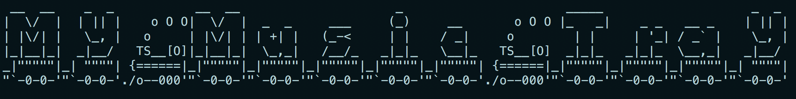
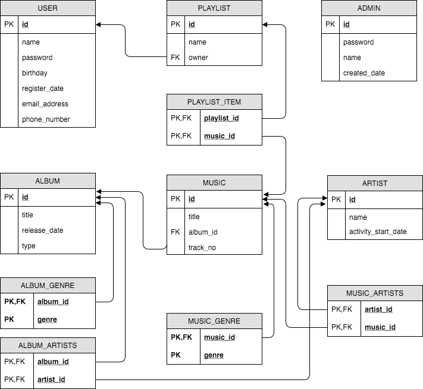

# MyMusicTray
Imaginary Music Player with MySQL




### Usage


```bash
# Clone or download repository
cd MyMusicTray
ant
java -jar MyMusicTray.jar
```

(MySQL or MariaDB server is required)


### Course
should be Jdk 13.0
ITE2083(Database System) @ [Hanyang University](http://hanyang.ac.kr)


### Features

| Home                                     | Admin features                           | User features                            |
| ---------------------------------------- | ---------------------------------------- | ---------------------------------------- |
| A1. Login admin<br />A2. User login<br />A3. User Signup | B1. View Musics <br />B2. Manage Artists<br />B3. Manage Albums <br />B4. Add new Artist <br />B5. Add new Album <br />B6. Register new admin <br />B7. Change password<br />B8. Remove account | C1. View Musics <br />C2. View Artists<br />C3. View Albums <br />C4. Manage Playlists<br />C5. Add new playlist<br />C6. Change password<br />C7. Remove account |

Especially, 'Manage Artists(B2)', 'Manage Albums(B3)', and 'Manage Playlists(C4)' supports sub features like below.

| Manage Artists (B2)                      | Manage Albums (B3)                       | Manage Playlists (C4)                    |
| ---------------------------------------- | ---------------------------------------- | ---------------------------------------- |
| D1. Edit information <br />D2. Remove artist | E1. Add artist to this album<br />E2. Add music to this album<br />E3. Remove music<br />E4. Edit information<br />E5. Remove album | F1. Add music to this playlist<br />F2. Remove music in this playlist<br />F3. Remove playlist |


### Relational Data Model Scheme




### CRUD supports for each tables

| Table           | select | insert | update | delete |
| --------------- | ------ | ------ | ------ | ------ |
| admin           | A1     | B6     | B7     | B8     |
| album           | B3, C3 | B5     | E4     | E5     |
| *album_genre*   | B3, C3 | B5     |        |        |
| *album_artists* | B3, C3 | E1     |        |        |
| artist          | B2, C2 | B4     | D1     | D2     |
| music           | B1, C1 | E2     |        | E3     |
| *music_genre*   | B1, C1 | E2     |        |        |
| *music_artists* | B1, C1 | E2     |        |        |
| playlist        | C4     | C5     |        | F3     |
| *playlist_item* | C4     | F1     |        | F2     |
| user            | A2     | A3     | C6     | C7     |


### License

MIT

